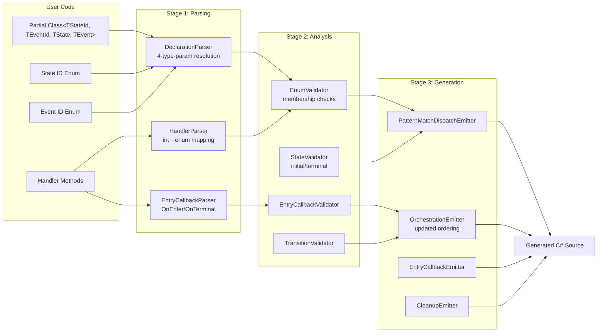

# Design Document: Generic State Machine API

## Overview

This design replaces the string-based `[State("name")]` / `[Trigger("name")]` class-level attribute API with a generic, enum-driven approach. The state machine class declares four explicit type parameters: `TStateId` (state ID enum), `TEventId` (event ID enum), `TState` (full state type), and `TEvent` (full event type). The ID type parameters are constrained with `struct, Enum` at the language level, meaning the C# compiler itself rejects non-enum types before the generator ever runs. The state and event types are constrained to `IStateMachineState<TStateId>` and `IDispatchableEvent<TEventId>` respectively. The generator derives valid states and triggers from enum members, eliminating redundant declarations and providing compile-time type safety.

The canonical class declaration pattern is:

```csharp
[InitialState((int)OrderStateId.Pending)]
[TerminalState((int)OrderStateId.Cancelled)]
public static partial class OrderMachine<TStateId, TEventId, TState, TEvent>
    where TStateId : struct, Enum
    where TEventId : struct, Enum
    where TState : IStateMachineState<TStateId>
    where TEvent : IDispatchableEvent<TEventId>
{
    [Transition((int)OrderStateId.Pending, (int)OrderStateId.Confirmed, (int)OrderEventId.Confirm)]
    public static TState HandleConfirm(TState state, TEvent @event)
        => ...;
}
```

Additionally, this design introduces:
- `[InitialState]` and `[TerminalState]` class-level attributes for lifecycle designation
- `[OnEnter]` method-level attribute for state-entry callbacks (targeted and catch-all)
- `[OnTerminal]` method-level attribute for cleanup handlers
- Updated `[Transition]`, `[Guard]`, and `[SideEffect]` attributes accepting `int`-cast enum values
- Pattern-matching-based dispatch in generated code
- Updated orchestration ordering with state-entry callbacks
- `TransitionResult<TState>` carrying the resulting state on success

The old `[State]` and `[Trigger]` attributes are removed entirely — there are no existing users requiring backward compatibility.

## Architecture

The existing three-stage pipeline architecture (Parsing → Analysis → Generation) is preserved. Each stage remains a pure function operating on value-type data models. The changes affect all three stages but do not alter the fundamental pipeline structure.



### Key Architectural Decisions

1. **Integer-cast enum pattern for attributes**: C# requires constant expressions in attribute arguments. Enum values are passed as `(int)StateId.Pending` and resolved back to enum member names during parsing via the semantic model. The `int` in the attribute is not the ID type — it's the C# mechanism for passing enum values into attributes.

2. **Four explicit type parameters with `struct, Enum` constraints**: The state machine class declares `<TStateId, TEventId, TState, TEvent>` where `TStateId : struct, Enum` and `TEventId : struct, Enum`. This means the C# compiler itself rejects non-enum ID types — the generator never needs to emit a "not an enum" diagnostic (SMSG017 is removed). The generator only needs to validate `[Flags]` usage and enum member resolution.

3. **Enum member extraction via semantic model**: The parser uses Roslyn's `INamedTypeSymbol` to enumerate members of the state/event ID enum types, rather than relying on syntax-level analysis.

4. **Pattern matching in generated dispatch**: The generated `HandleAsync` uses `switch` statements over enum values (not string comparisons), producing clearer and more efficient code.

5. **State-entry callbacks in orchestration**: Entry callbacks execute after the transition handler but before persist, allowing state mutation. The catch-all `[OnEnter]` (void return) runs after any targeted callback for observational purposes. Both sync and async signatures are supported — the generator detects the return type and emits appropriate `await` calls.

6. **Terminal state orchestration divergence**: Terminal transitions follow a different ordering (cleanup replaces side-effect) to support end-of-lifecycle semantics. The cleanup handler is async (`Task`) to support I/O operations like database deletion.

7. **`[Flags]` enums rejected**: Enums decorated with `[Flags]` are not valid as state or event ID types. The generator emits a diagnostic error because bitwise-combined values don't map to discrete states.

8. **Guard rejection is distinguishable**: `HandleAsync` returns `TransitionResult.GuardRejected` when a guard blocks a transition, distinct from `TransitionResult.NoTransition` (no matching state/event pair).

9. **`TransitionResult<TState>` carries resulting state**: On success, the result includes the post-transition state object, avoiding an unnecessary persistence round-trip for callers.

## Components and Interfaces

### New Attributes (StateMachineSrcGen.Attributes)

```csharp
/// <summary>Designates the initial state of the state machine.</summary>
[AttributeUsage(AttributeTargets.Class, AllowMultiple = false)]
public sealed class InitialStateAttribute : Attribute
{
    public int State { get; }
    public InitialStateAttribute(int state) => State = state;
}

/// <summary>Designates a terminal/final state of the state machine.</summary>
[AttributeUsage(AttributeTargets.Class, AllowMultiple = true)]
public sealed class TerminalStateAttribute : Attribute
{
    public int State { get; }
    public TerminalStateAttribute(int state) => State = state;
}

/// <summary>Marks a method as a state-entry callback.</summary>
[AttributeUsage(AttributeTargets.Method, AllowMultiple = false)]
public sealed class OnEnterAttribute : Attribute
{
    /// <summary>The target state ID, or -1 for catch-all.</summary>
    public int State { get; }
    public bool IsCatchAll { get; }

    /// <summary>Targeted entry callback for a specific state.</summary>
    public OnEnterAttribute(int state) { State = state; IsCatchAll = false; }

    /// <summary>Catch-all entry callback invoked on every state entry.</summary>
    public OnEnterAttribute() { State = -1; IsCatchAll = true; }
}

/// <summary>Marks a method as the terminal-state cleanup handler.</summary>
[AttributeUsage(AttributeTargets.Method, AllowMultiple = false)]
public sealed class OnTerminalAttribute : Attribute { }
```

### Updated Attributes

```csharp
/// <summary>Marks a method as a transition handler.</summary>
[AttributeUsage(AttributeTargets.Method, AllowMultiple = false)]
public sealed class TransitionAttribute : Attribute
{
    public int From { get; }
    public int To { get; }
    public int Trigger { get; }

    public TransitionAttribute(int from, int to, int trigger)
    {
        From = from;
        To = to;
        Trigger = trigger;
    }
}

/// <summary>Marks a method as a guard for a transition.</summary>
[AttributeUsage(AttributeTargets.Method, AllowMultiple = false)]
public sealed class GuardAttribute : Attribute
{
    public int From { get; }
    public int To { get; }
    public int Trigger { get; }

    public GuardAttribute(int from, int to, int trigger)
    {
        From = from;
        To = to;
        Trigger = trigger;
    }
}

/// <summary>Marks a method as a side effect for a transition.</summary>
[AttributeUsage(AttributeTargets.Method, AllowMultiple = false)]
public sealed class SideEffectAttribute : Attribute
{
    public int From { get; }
    public int To { get; }
    public int Trigger { get; }

    public SideEffectAttribute(int from, int to, int trigger)
    {
        From = from;
        To = to;
        Trigger = trigger;
    }
}
```

### Removed Attributes

- `StateAttribute` — replaced by enum member derivation
- `TriggerAttribute` — replaced by enum member derivation

### Updated Parsing Pipeline

The `DeclarationParser` is updated to:

1. **Extract four type parameters**: Identify `TStateId`, `TEventId`, `TState`, and `TEvent` from the class declaration. Resolve the concrete enum types for `TStateId` and `TEventId` from the compilation's type argument bindings. The `struct, Enum` constraint is enforced by the compiler — the generator only sees valid enum types.

2. **Enumerate enum members**: Use `INamedTypeSymbol.GetMembers()` to extract all enum fields as the valid state/trigger set.

3. **Validate `[Flags]` absence**: Check that neither the state ID enum nor the event ID enum has the `[Flags]` attribute. Emit SMSG026 if present.

4. **Parse `[InitialState]` and `[TerminalState]`**: Extract integer arguments and resolve to enum member names.

5. **Parse `[OnEnter]` and `[OnTerminal]`**: Extract from method-level attributes, distinguishing targeted vs. catch-all entry callbacks.

The `HandlerParser` is updated to:

1. **Resolve integer attribute arguments to enum members**: For `[Transition(from, to, trigger)]`, `[Guard(from, to, trigger)]`, and `[SideEffect(from, to, trigger)]`, map each `int` argument back to the corresponding enum member name using the resolved enum type symbol.

2. **Parse entry callback handlers**: Identify `[OnEnter]` and `[OnTerminal]` decorated methods and validate their signatures.

```csharp
// Pseudocode for integer-to-enum resolution
static string? ResolveEnumMember(INamedTypeSymbol enumType, int value)
{
    foreach (var member in enumType.GetMembers().OfType<IFieldSymbol>())
    {
        if (member.HasConstantValue && Convert.ToInt32(member.ConstantValue) == value)
            return member.Name;
    }
    return null; // triggers diagnostic
}
```

### Updated Analysis Pipeline

New/updated validators:

| Validator | Changes |
|-----------|---------|
| `EnumValidator` (new) | Validates state/event ID types are enums; validates all attribute int values resolve to enum members |
| `StateValidator` | Updated to validate `[InitialState]`/`[TerminalState]` against enum members; checks initial+terminal overlap (warning) |
| `TransitionValidator` | Simplified — enum membership validation replaces string-based undefined-state/trigger checks |
| `EntryCallbackValidator` (new) | Validates [OnEnter] uniqueness (one catch-all max, no duplicate targeted states), [OnTerminal] uniqueness (one max), signature conformance |
| `SignatureValidator` | Extended to validate entry callback and cleanup handler signatures |

### Updated Generation Pipeline

New/updated emitters:

| Emitter | Changes |
|---------|---------|
| `EventDispatchEmitter` | Rewritten to emit `switch (eventId)` with enum case labels instead of string cases |
| `OrchestrationEmitter` | Updated ordering: guard → handler → entry callback → persist → side-effect (non-terminal) or guard → handler → entry callback → persist → cleanup (terminal) |
| `EntryCallbackEmitter` (new) | Emits targeted then catch-all entry callback invocations |
| `CleanupEmitter` (new) | Emits cleanup handler invocation for terminal-state transitions |
| `HandleMethodEmitter` | Updated to use enum types in method signature and dispatch |

### Generated Code Example (Non-Terminal Transition)

```csharp
// Generated HandleAsync method for OrderMachine<OrderStateId, OrderEventId, OrderState, OrderEvent>
public static async Task<TransitionResult<OrderState>> HandleAsync(OrderEvent @event)
{
    await _lock.AcquireAsync().ConfigureAwait(false);
    try
    {
        var currentState = await _persistence.LoadAsync().ConfigureAwait(false);
        var eventId = @event.GetEventId();

        switch (eventId)
        {
            case OrderEventId.Confirm:
            {
                if (currentState.GetStateId() == OrderStateId.Pending)
                {
                    if (!GuardConfirm(currentState, @event))
                        return TransitionResult<OrderState>.GuardRejected;

                    var newState = HandleConfirm(currentState, @event);
                    newState = OnEnterConfirmed(newState, @event);  // targeted entry
                    OnEnterAny(newState, @event);                    // catch-all (void)
                    await _persistence.SaveAsync(newState).ConfigureAwait(false);
                    AfterConfirm(newState, @event);                  // side-effect
                    return TransitionResult<OrderState>.Succeeded(newState);
                }
                break;
            }
            // ... other event cases
        }

        return TransitionResult<OrderState>.NoTransition;
    }
    finally
    {
        _lock.Release();
    }
}
```

### Generated Code Example (Terminal Transition)

```csharp
// Terminal transition case within the same switch
case OrderEventId.Cancel:
{
    if (currentState.GetStateId() == OrderStateId.Pending)
    {
        var newState = HandleCancel(currentState, @event);
        newState = OnEnterCancelled(newState, @event);  // targeted entry
        OnEnterAny(newState, @event);                    // catch-all (void)
        await _persistence.SaveAsync(newState).ConfigureAwait(false);
        await OnTerminalCleanup(newState).ConfigureAwait(false);  // async cleanup
        return TransitionResult<OrderState>.Succeeded(newState);
    }
    break;
}
```

## Data Models

### ParsedStateMachine (Updated)

```csharp
public readonly record struct ParsedStateMachine : IEquatable<ParsedStateMachine>
{
    // Existing fields retained
    public required string Namespace { get; init; }
    public required string ClassName { get; init; }
    public required ClassModifiers Modifiers { get; init; }
    public required Location Location { get; init; }

    // Four type parameters (resolved from class declaration)
    public required string StateIdEnumTypeName { get; init; }   // TStateId concrete type
    public required string EventIdEnumTypeName { get; init; }   // TEventId concrete type
    public required string StateTypeName { get; init; }         // TState concrete type
    public required string EventTypeName { get; init; }         // TEvent concrete type

    // States derived from TStateId enum members
    public required EquatableArray<ParsedState> States { get; init; }

    // Events derived from TEventId enum members
    public required EquatableArray<ParsedEvent> Events { get; init; }

    // Handler methods
    public required EquatableArray<ParsedHandler> Handlers { get; init; }

    // Lifecycle
    public required string? InitialStateName { get; init; }
    public required EquatableArray<string> TerminalStateNames { get; init; }
    public required EquatableArray<ParsedEntryCallback> EntryCallbacks { get; init; }
    public required ParsedCleanupHandler? CleanupHandler { get; init; }
}
```

### New Data Models

```csharp
/// <summary>Represents a parsed event/trigger derived from an enum member.</summary>
public readonly record struct ParsedEvent : IEquatable<ParsedEvent>
{
    public required string Name { get; init; }
    public required int IntValue { get; init; }
    public required Location Location { get; init; }
}

/// <summary>Represents a parsed state-entry callback.</summary>
public readonly record struct ParsedEntryCallback : IEquatable<ParsedEntryCallback>
{
    public required string MethodName { get; init; }
    public required string? TargetStateName { get; init; } // null = catch-all
    public required bool IsCatchAll { get; init; }
    public required MethodSignature Signature { get; init; }
    public required Location Location { get; init; }
}

/// <summary>Represents a parsed cleanup handler.</summary>
public readonly record struct ParsedCleanupHandler : IEquatable<ParsedCleanupHandler>
{
    public required string MethodName { get; init; }
    public required MethodSignature Signature { get; init; }
    public required Location Location { get; init; }
}
```

### ValidatedStateMachine (Updated)

```csharp
public readonly record struct ValidatedStateMachine : IEquatable<ValidatedStateMachine>
{
    // Class identity
    public required string Namespace { get; init; }
    public required string ClassName { get; init; }

    // Four resolved type names
    public required string StateIdEnumTypeName { get; init; }
    public required string EventIdEnumTypeName { get; init; }
    public required string StateTypeName { get; init; }
    public required string EventTypeName { get; init; }

    // Validated states and transitions
    public required EquatableArray<ValidatedState> States { get; init; }
    public required ValidatedState InitialState { get; init; }
    public required EquatableArray<ValidatedTransition> Transitions { get; init; }

    // Lifecycle hooks
    public required EquatableArray<ValidatedEntryCallback> EntryCallbacks { get; init; }
    public required string? CleanupHandlerMethodName { get; init; }
}
```

### ValidatedEntryCallback (New)

```csharp
public readonly record struct ValidatedEntryCallback : IEquatable<ValidatedEntryCallback>
{
    public required string MethodName { get; init; }
    public required string? TargetStateName { get; init; } // null = catch-all
    public required bool IsCatchAll { get; init; }
    public required bool ReturnsTState { get; init; } // true for targeted, false for catch-all
}
```

### ValidatedTransition (Updated)

```csharp
public readonly record struct ValidatedTransition : IEquatable<ValidatedTransition>
{
    public required string FromState { get; init; }
    public required string ToState { get; init; }
    public required string Trigger { get; init; }
    public required int FromStateEnumValue { get; init; }  // New
    public required int ToStateEnumValue { get; init; }    // New
    public required int TriggerEnumValue { get; init; }    // New
    public required string HandlerMethodName { get; init; }
    public required string? GuardMethodName { get; init; }
    public required string? SideEffectMethodName { get; init; }
    public required bool IsTerminal { get; init; }         // New
    public required int DeclarationOrder { get; init; }
}
```

### ValidatedState (Updated)

```csharp
public readonly record struct ValidatedState : IEquatable<ValidatedState>
{
    public required string Name { get; init; }
    public required int EnumValue { get; init; }  // New
    public required bool IsInitial { get; init; }
    public required bool IsTerminal { get; init; }
}
```

### HandlerKind (Updated)

```csharp
public enum HandlerKind
{
    Transition,
    Guard,
    SideEffect,
    EntryCallback,  // New
    Cleanup         // New
}
```

### TransitionResult<TState> (New)

```csharp
/// <summary>Result of a state machine transition attempt.</summary>
public readonly struct TransitionResult<TState>
{
    public TransitionOutcome Outcome { get; }
    public TState? State { get; }

    private TransitionResult(TransitionOutcome outcome, TState? state)
    {
        Outcome = outcome;
        State = state;
    }

    public static TransitionResult<TState> Succeeded(TState newState)
        => new(TransitionOutcome.Success, newState);

    public static TransitionResult<TState> GuardRejected
        => new(TransitionOutcome.GuardRejected, default);

    public static TransitionResult<TState> NoTransition
        => new(TransitionOutcome.NoTransition, default);

    public bool IsSuccess => Outcome == TransitionOutcome.Success;
}

public enum TransitionOutcome
{
    Success,
    GuardRejected,
    NoTransition
}
```

### New Diagnostics

| ID | Severity | Description |
|----|----------|-------------|
| SMSG018 | Error | Invalid enum value in attribute: `Value {0} is not a member of enum {1}. Valid members: {2}` |
| SMSG019 | Error | Missing type constraint: `State type "{0}" does not implement IStateMachineState<{1}>` |
| SMSG020 | Warning | State is both initial and terminal: `State "{0}" is designated as both initial and terminal` |
| SMSG021 | Error | Multiple cleanup handlers: `Only one [OnTerminal] method is permitted per state machine class` |
| SMSG022 | Error | Multiple catch-all entry callbacks: `Only one parameterless [OnEnter] method is permitted` |
| SMSG023 | Error | Duplicate targeted entry callback: `Multiple [OnEnter] methods target state "{0}"` |
| SMSG024 | Error | Invalid entry callback signature: `[OnEnter] method "{0}" must have signature: {1}` |
| SMSG025 | Error | Invalid cleanup handler signature: `[OnTerminal] method "{0}" must accept (TState) parameter and return Task` |
| SMSG026 | Error | Flags enum not supported: `Enum "{0}" has [Flags] attribute and cannot be used as a state/event ID type` |
| SMSG027 | Error | Invalid class type parameter count: `State machine class must declare exactly 4 type parameters: TStateId, TEventId, TState, TEvent` |

Note: SMSG017 (non-enum type parameter) is no longer needed — the `struct, Enum` constraint causes the C# compiler to reject non-enum types before the generator runs.

## Correctness Properties

*A property is a characteristic or behavior that should hold true across all valid executions of a system — essentially, a formal statement about what the system should do. Properties serve as the bridge between human-readable specifications and machine-verifiable correctness guarantees.*

### Property 1: Enum member extraction produces complete state set

*For any* valid enum type used as a state ID, the parser SHALL produce a state set whose names exactly match the set of enum member names (no missing, no extra).

**Validates: Requirements 1.3, 2.3**

### Property 2: Enum member extraction produces complete event set

*For any* valid enum type used as an event ID, the parser SHALL produce an event/trigger set whose names exactly match the set of enum member names (no missing, no extra).

**Validates: Requirements 1.4, 2.4**

### Property 3: `[Flags]` enum produces diagnostic

*For any* enum type decorated with `[Flags]` used as a state ID or event ID type parameter, the generator SHALL emit diagnostic SMSG026.

**Validates: Clarification (Flags enum rejection)**

### Property 4: Integer-to-enum resolution round trip

*For any* valid enum member, casting it to `int` and passing it through the parser's enum resolution logic SHALL produce the original enum member name.

**Validates: Requirements 8.2**

### Property 5: Invalid enum value produces diagnostic

*For any* integer value that does not correspond to a defined member of the target enum, the generator SHALL emit a diagnostic error (SMSG018) referencing the enum type and valid members.

**Validates: Requirements 3.4, 4.3, 4.4, 4.5, 5.3, 8.3, 10.3, 13.10**

### Property 6: Initial state cardinality enforcement

*For any* state machine class declaration, if zero `[InitialState]` attributes are present the generator SHALL emit SMSG005, and if more than one is present it SHALL emit SMSG006.

**Validates: Requirements 3.2, 3.3**

### Property 7: Valid enum-based definitions produce no SMSG002/SMSG003

*For any* fully valid state machine definition using enum-based type parameters where all attribute values resolve to valid enum members, the generator SHALL emit zero SMSG002 or SMSG003 diagnostics.

**Validates: Requirements 6.3**

### Property 8: Duplicate transition detection preserved

*For any* state machine definition containing two or more handlers with the same (From, To, Trigger) triple, the generator SHALL emit SMSG001 regardless of whether the enum-based or legacy API is used.

**Validates: Requirements 6.4**

### Property 9: Unreachable state detection for enum members

*For any* state machine definition where a non-initial enum member is not the target of any transition, the generator SHALL emit SMSG009 for that member.

**Validates: Requirements 6.5**

### Property 10: Generated dispatch uses enum comparisons

*For any* validated state machine with enum-based state and event IDs, the generated dispatch code SHALL contain enum member references (e.g., `StateId.Pending`, `EventId.Confirm`) and SHALL NOT contain string literal comparisons for state or event routing.

**Validates: Requirements 7.1, 7.2, 7.3, 7.4**

### Property 11: Non-terminal orchestration ordering

*For any* validated state machine with a non-terminal transition that has a guard, entry callback, and side-effect, the generated code SHALL follow the ordering: lock-acquire → guard → transition handler → targeted entry callback → catch-all entry callback → persist → side-effect → lock-release.

**Validates: Requirements 7.5, 13.6, 13.9**

### Property 12: Terminal orchestration ordering

*For any* validated state machine with a terminal-state transition that has a cleanup handler and entry callback, the generated code SHALL follow the ordering: lock-acquire → guard → transition handler → targeted entry callback → catch-all entry callback → persist → cleanup → lock-release, with no side-effect invocation.

**Validates: Requirements 10.5, 10.10**

### Property 13: Entry callback uniqueness enforcement

*For any* state machine class with multiple parameterless `[OnEnter]` methods, the generator SHALL emit SMSG022. *For any* state machine class with multiple targeted `[OnEnter]` methods referencing the same state, the generator SHALL emit SMSG023.

**Validates: Requirements 13.5, 13.11**

### Property 14: Cleanup handler uniqueness enforcement

*For any* state machine class with multiple `[OnTerminal]` methods, the generator SHALL emit SMSG021.

**Validates: Requirements 10.8**

### Property 15: Targeted entry callback returns TState

*For any* targeted `[OnEnter(stateId)]` method, the generated code SHALL use the return value of the entry callback as the state passed to subsequent operations (persist). The method signature SHALL accept (TState, TEvent) and return TState.

**Validates: Requirements 13.7, 13.8**

### Property 16: Catch-all entry callback is void and observational

*For any* catch-all `[OnEnter]` method (parameterless attribute), the method SHALL have `void` return type and receive (TState, TEvent) parameters. The generated code SHALL invoke it after any targeted callback without using a return value.

**Validates: Requirements 13.12, 13.3**

### Property 17: Terminal transition without cleanup completes normally

*For any* validated state machine with a terminal-state transition but no `[OnTerminal]` handler defined, the generated code SHALL complete the transition (handler → entry → persist) without invoking any cleanup logic and SHALL return Success.

**Validates: Requirements 10.6**

### Property 18: Generated code compiles without errors

*For any* valid `ValidatedStateMachine` input, the generation pipeline SHALL produce C# source that compiles without errors when combined with the attributes assembly and appropriate type definitions.

**Validates: Requirements 7.1, 7.2, 7.3, 7.4, 7.5, 7.6**

## Error Handling

### Generator Error Strategy (Unchanged)

The generator follows the existing fail-safe strategy:

1. **Never crash the compiler** — all exceptions caught and converted to SMSG015
2. **No partial output** — if any Error-severity diagnostic is emitted, zero source is generated for that definition
3. **Actionable messages** — every diagnostic references the enum type and valid members where applicable
4. **No cascading errors** — processing stops for a definition after the first error category

### Error Scenarios Specific to This Feature

| Scenario | Behavior |
|----------|----------|
| Non-enum type parameter | Rejected by C# compiler (`struct, Enum` constraint) — generator never sees this |
| `[Flags]` enum used as state/event ID | Emit SMSG026, halt processing |
| Integer doesn't resolve to enum member | Emit SMSG018 with valid members list |
| State type missing IStateMachineState | Emit SMSG019 |
| Event type missing IDispatchableEvent | Emit SMSG016 (existing) |
| Wrong number of type parameters | Emit SMSG027 |
| Multiple [InitialState] | Emit SMSG006 |
| No [InitialState] | Emit SMSG005 |
| Initial + Terminal overlap | Emit SMSG020 (warning), continue processing |
| Multiple [OnTerminal] | Emit SMSG021 |
| Multiple catch-all [OnEnter] | Emit SMSG022 |
| Duplicate targeted [OnEnter] | Emit SMSG023 |
| Invalid entry callback signature | Emit SMSG024 |
| Invalid cleanup handler signature | Emit SMSG025 |
| Guard rejects transition | Return `TransitionResult<TState>.GuardRejected` (no state mutation) |

### Diagnostic Message Quality

All new diagnostics referencing enum types SHALL include:
- The enum type name (fully qualified if ambiguous)
- The invalid value provided
- The list of valid enum members (for SMSG018)

## Testing Strategy

### Property-Based Testing (FsCheck + xUnit)

Property-based testing is the primary testing strategy. This feature involves pure-function pipeline stages with clear input/output behavior, making it ideal for PBT.

**Library**: FsCheck.Xunit (already in use)
**Minimum iterations**: 100 per property test
**Tag format**: `Feature: generic-state-machine-api, Property {N}: {description}`

Each correctness property maps to one `[Property]` test method. Custom `Arbitrary<T>` generators will be created for:
- `ParsedStateMachine` with enum-based fields
- Valid and invalid enum type configurations
- Various entry callback and cleanup handler configurations
- `ValidatedStateMachine` with terminal/non-terminal transitions

### Unit Tests (Example-Based)

Unit tests complement property tests for:
- Specific diagnostic message format verification (Requirements 9.1, 9.2)
- Playground compilation verification (Requirement 11)
- Snapshot tests for generated output stability
- Integration tests verifying end-to-end compilation

### Test Organization

```
tests/StateMachineSrcGen.Tests/
├── Parsing/
│   ├── EnumExtractionPropertyTests.cs      # Properties 1, 2
│   ├── IntToEnumResolutionPropertyTests.cs # Property 4
│   ├── EntryCallbackParsingTests.cs        # Properties 13, 15, 16
│   └── DiagnosticMessageTests.cs           # Requirements 9.1, 9.2
├── Analysis/
│   ├── EnumValidationPropertyTests.cs      # Properties 3, 5, 7
│   ├── CardinalityPropertyTests.cs         # Properties 6, 8, 9, 13, 14
│   └── EntryCallbackValidationTests.cs     # Properties 13, 14
├── Generation/
│   ├── EnumDispatchPropertyTests.cs        # Property 10, 18
│   ├── OrchestrationOrderingTests.cs       # Properties 11, 12, 17
│   └── EntryCallbackEmissionTests.cs       # Properties 15, 16
├── Orchestration/
│   └── RuntimeBehaviorTests.cs             # End-to-end runtime verification
├── Integration/
│   └── FullPipelineCompilationTests.cs     # Property 18
└── Generators/
    └── GenericApiArbitraries.cs            # FsCheck generators for new models
```

### Property Test Configuration

- Each property test runs minimum 100 iterations
- Each test is tagged with a comment: `// Feature: generic-state-machine-api, Property N: description`
- FsCheck generators produce both valid and invalid inputs to test both success and error paths
- Generated code compilation tests use in-memory Roslyn compilation (existing pattern)
