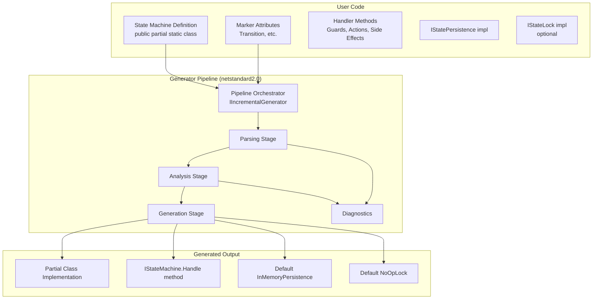
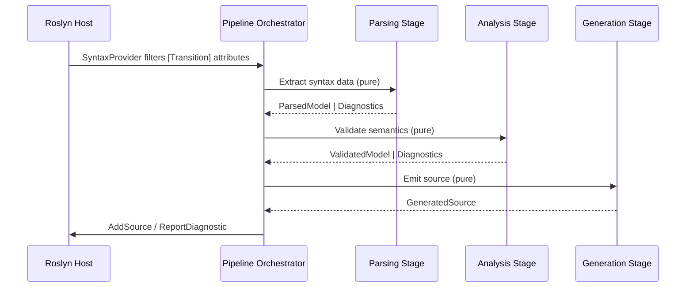
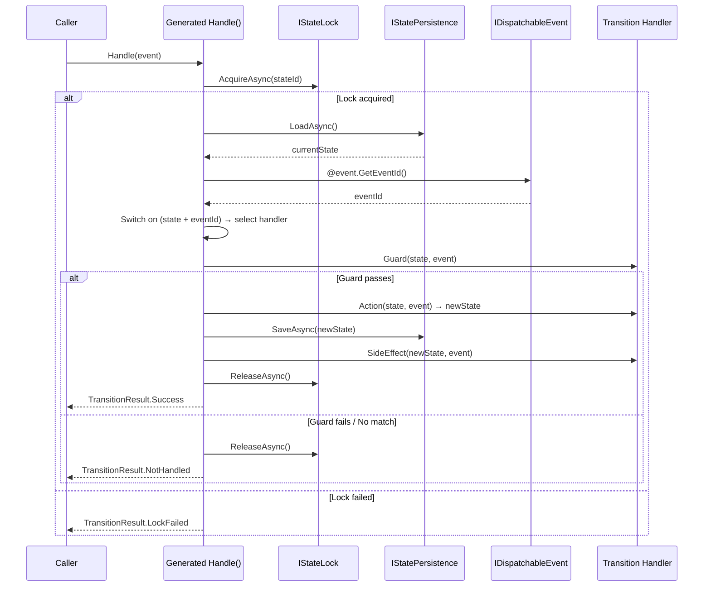
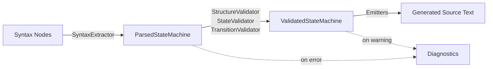

# Design Document: State Machine Source Generator

## Overview

StateMachineSrcGen is a Roslyn Incremental Source Generator that transforms concise, attribute-decorated C# class declarations into fully-functional state machine implementations at compile time. The generator eliminates boilerplate by producing code that validates structure, evaluates transitions, invokes user-defined logic (guards, actions, side effects), and orchestrates state persistence — all without runtime reflection.

The generator operates as a three-stage pipeline of pure functions:

1. **Parsing** — Extracts syntactic information from decorated classes into an intermediate model
2. **Analysis** — Validates semantic correctness (states, triggers, transitions, signatures)
3. **Generation** — Emits complete, compilable C# source from the validated model

Each stage is independently testable, leverages Roslyn's incremental caching for IDE responsiveness, and degrades gracefully on malformed input by emitting actionable diagnostics rather than throwing exceptions.

### Key Design Decisions

| Decision | Rationale |
|----------|-----------|
| Pure-function pipeline stages | Enables property-based testing, deterministic behavior, and incremental caching |
| Value-type data models with `Equatable` | Required for Roslyn's incremental cache to detect unchanged inputs |
| Separate attributes assembly | Users reference only lightweight markers; no Roslyn dependency leaks |
| No partial output on errors | Prevents confusing IDE behavior from incomplete generated code |
| Default no-op lock provider | Allows opt-in concurrency without forcing overhead on simple use cases |
| Generic `IStatePersistence<TState>` | Supports rich state objects, not just enum/string state identifiers |

## Architecture



### Pipeline Flow



### Runtime Orchestration (Generated Code)



## Components and Interfaces

### Attributes Assembly (`StateMachineSrcGen.Attributes`)

```csharp
namespace StateMachineSrcGen;

/// <summary>Marks a method as a transition handler.</summary>
[AttributeUsage(AttributeTargets.Method, AllowMultiple = false)]
public sealed class TransitionAttribute : Attribute
{
    public string From { get; }
    public string To { get; }
    public string Trigger { get; }
    
    /// <summary>
    /// The event ID value that this handler responds to.
    /// Used by the generated dispatch switch to route events to the correct handler.
    /// </summary>
    public object? EventId { get; set; }
    
    public TransitionAttribute(string from, string to, string trigger) { ... }
}

/// <summary>Marks a method as a guard for a transition.</summary>
[AttributeUsage(AttributeTargets.Method, AllowMultiple = false)]
public sealed class GuardAttribute : Attribute
{
    public string From { get; }
    public string To { get; }
    public string Trigger { get; }
    
    public GuardAttribute(string from, string to, string trigger) { ... }
}

/// <summary>Marks a method as a side effect for a transition.</summary>
[AttributeUsage(AttributeTargets.Method, AllowMultiple = false)]
public sealed class SideEffectAttribute : Attribute
{
    public string From { get; }
    public string To { get; }
    public string Trigger { get; }
    
    public SideEffectAttribute(string from, string to, string trigger) { ... }
}

/// <summary>Declares a state in the state machine.</summary>
[AttributeUsage(AttributeTargets.Class, AllowMultiple = true)]
public sealed class StateAttribute : Attribute
{
    public string Name { get; }
    public bool IsInitial { get; set; }
    
    public StateAttribute(string name) { ... }
}

/// <summary>Declares a trigger (event type) in the state machine.</summary>
[AttributeUsage(AttributeTargets.Class, AllowMultiple = true)]
public sealed class TriggerAttribute : Attribute
{
    public string Name { get; }
    
    public TriggerAttribute(string name) { ... }
}
```

### User-Facing Interfaces (Generated)

```csharp
/// <summary>Main state machine interface.</summary>
public interface IStateMachine<TState, TEvent>
{
    Task<TransitionResult> HandleAsync(TEvent @event);
}

/// <summary>Persistence provider interface.</summary>
public interface IStatePersistence<TState>
{
    Task<TState> LoadAsync();
    Task SaveAsync(TState state);
}

/// <summary>Lock provider interface.</summary>
public interface IStateLock<TState>
{
    Task<bool> AcquireAsync();
    Task ReleaseAsync();
}

/// <summary>
/// Interface that the user's event type must implement to support
/// automatic dispatch extraction. The generated code calls GetEventId()
/// to obtain the identifier used in the dispatch switch statement.
/// </summary>
public interface IDispatchableEvent<TEventId>
    where TEventId : IEquatable<TEventId>
{
    TEventId GetEventId();
}

/// <summary>Result of a transition attempt.</summary>
public enum TransitionResult
{
    Success,
    NotHandled,
    LockFailed
}
```

### Parsing Stage

| Component | Responsibility |
|-----------|---------------|
| `SyntaxExtractor` | Filters syntax nodes with target attributes via `SyntaxProvider` |
| `DeclarationParser` | Extracts class modifiers, generics, interface implementations |
| `HandlerParser` | Extracts method signatures, attribute parameters (including EventId), return types |
| `DispatchInterfaceParser` | Validates that the event type implements `IDispatchableEvent<TEventId>` and extracts the `TEventId` type |
| `ParsedModelFactory` | Assembles extracted data into `ParsedStateMachine` value type |

**Input:** `GeneratorSyntaxContext` (syntax node + semantic model reference)  
**Output:** `ParsedStateMachine` (value type, equatable)

### Analysis Stage

| Component | Responsibility |
|-----------|---------------|
| `StructureValidator` | Validates class shape (public, partial, static, generics, interfaces) |
| `StateValidator` | Checks for duplicates, initial state, unreachable states |
| `TriggerValidator` | Checks for duplicate triggers |
| `TransitionValidator` | Validates handler references, duplicate handlers, missing targets |
| `SignatureValidator` | Validates handler method signatures match expected patterns |

**Input:** `ParsedStateMachine`  
**Output:** `ValidatedStateMachine` | `ImmutableArray<Diagnostic>`

### Generation Stage

| Component | Responsibility |
|-----------|---------------|
| `HandleMethodEmitter` | Generates the `HandleAsync` dispatch logic including the `GetEventId()` switch statement |
| `EventDispatchEmitter` | Generates the switch/case block over `@event.GetEventId()` routing to per-handler methods |
| `TransitionEvaluator` | Generates guard evaluation and transition selection |
| `PersistenceEmitter` | Generates default `InMemoryPersistence<TState>` |
| `LockEmitter` | Generates default `NoOpLock<TState>` |
| `OrchestrationEmitter` | Generates the load→invoke→receive→save protocol |
| `SourceFormatter` | Applies consistent formatting and XML doc comments |

**Input:** `ValidatedStateMachine`  
**Output:** `string` (generated C# source text)

### Diagnostics

| ID | Severity | Description |
|----|----------|-------------|
| SMSG001 | Error | Duplicate transition handler |
| SMSG002 | Error | Undefined state referenced |
| SMSG003 | Error | Undefined trigger referenced |
| SMSG004 | Error | No states declared |
| SMSG005 | Error | No initial state designated |
| SMSG006 | Error | Multiple initial states |
| SMSG007 | Error | Duplicate state names |
| SMSG008 | Error | Duplicate trigger names |
| SMSG009 | Warning | Unreachable state detected |
| SMSG010 | Error | Invalid class declaration (missing modifiers/generics) |
| SMSG011 | Error | Missing IStateMachine implementation |
| SMSG012 | Error | Invalid handler signature |
| SMSG013 | Error | Missing IStatePersistence implementation |
| SMSG014 | Error | Missing target state in transition |
| SMSG015 | Error | Internal generator error (catch-all) |
| SMSG016 | Error | Event type does not implement IDispatchableEvent interface |

## Data Models

All pipeline data models are **value types** (records/structs) implementing `IEquatable<T>` to enable Roslyn's incremental caching.

```csharp
// === Parsing Stage Output ===

/// <summary>Complete parsed representation of a state machine definition.</summary>
public readonly record struct ParsedStateMachine
{
    public required string Namespace { get; init; }
    public required string ClassName { get; init; }
    public required string StateTypeName { get; init; }
    public required string EventTypeName { get; init; }
    public required EquatableArray<ParsedState> States { get; init; }
    public required EquatableArray<ParsedTrigger> Triggers { get; init; }
    public required EquatableArray<ParsedHandler> Handlers { get; init; }
    public required ClassModifiers Modifiers { get; init; }
    public required bool ImplementsIStateMachine { get; init; }
    public required bool ImplementsIStatePersistence { get; init; }
    public required bool ImplementsIDispatchableEvent { get; init; }
    public required string? EventIdTypeName { get; init; }  // TEventId from IDispatchableEvent<TEventId>
    public required Location Location { get; init; }
}

public readonly record struct ParsedState
{
    public required string Name { get; init; }
    public required bool IsInitial { get; init; }
    public required Location Location { get; init; }
}

public readonly record struct ParsedTrigger
{
    public required string Name { get; init; }
    public required Location Location { get; init; }
}

public readonly record struct ParsedHandler
{
    public required string MethodName { get; init; }
    public required string FromState { get; init; }
    public required string ToState { get; init; }
    public required string Trigger { get; init; }
    public required string? EventId { get; init; }  // The event ID value this handler responds to
    public required HandlerKind Kind { get; init; }  // Transition, Guard, SideEffect
    public required MethodSignature Signature { get; init; }
    public required Location Location { get; init; }
}

public readonly record struct MethodSignature
{
    public required bool IsPublic { get; init; }
    public required bool IsStatic { get; init; }
    public required string ReturnType { get; init; }
    public required EquatableArray<ParameterInfo> Parameters { get; init; }
}

public readonly record struct ParameterInfo
{
    public required string Name { get; init; }
    public required string TypeName { get; init; }
}

[Flags]
public enum ClassModifiers
{
    None = 0,
    Public = 1,
    Partial = 2,
    Static = 4
}

public enum HandlerKind
{
    Transition,
    Guard,
    SideEffect
}

// === Analysis Stage Output ===

/// <summary>Validated and enriched state machine model ready for code generation.</summary>
public readonly record struct ValidatedStateMachine
{
    public required string Namespace { get; init; }
    public required string ClassName { get; init; }
    public required string StateTypeName { get; init; }
    public required string EventTypeName { get; init; }
    public required string EventIdTypeName { get; init; }  // TEventId from IDispatchableEvent<TEventId>
    public required EquatableArray<ValidatedState> States { get; init; }
    public required ValidatedState InitialState { get; init; }
    public required EquatableArray<ValidatedTransition> Transitions { get; init; }
}

public readonly record struct ValidatedState
{
    public required string Name { get; init; }
    public required bool IsInitial { get; init; }
    public required bool IsTerminal { get; init; }
}

public readonly record struct ValidatedTransition
{
    public required string FromState { get; init; }
    public required string ToState { get; init; }
    public required string Trigger { get; init; }
    public required string EventId { get; init; }  // The event ID value this transition responds to
    public required string HandlerMethodName { get; init; }
    public required string? GuardMethodName { get; init; }
    public required string? SideEffectMethodName { get; init; }
    public required int DeclarationOrder { get; init; }
}

// === Utility ===

/// <summary>
/// Wrapper around ImmutableArray that provides value equality for incremental caching.
/// </summary>
public readonly struct EquatableArray<T> : IEquatable<EquatableArray<T>>, IEnumerable<T>
    where T : IEquatable<T>
{
    private readonly ImmutableArray<T> _array;
    // Implements element-wise equality comparison
}
```

### Data Flow Summary



## Correctness Properties

*A property is a characteristic or behavior that should hold true across all valid executions of a system — essentially, a formal statement about what the system should do. Properties serve as the bridge between human-readable specifications and machine-verifiable correctness guarantees.*

### Property 1: Parsing extracts handler attributes correctly

*For any* method decorated with a `[Transition]` attribute specifying valid from-state, to-state, and trigger strings, the Parsing Stage shall produce a `ParsedHandler` whose `FromState`, `ToState`, and `Trigger` fields exactly match the attribute parameters.

**Validates: Requirements 1.1**

### Property 2: Duplicate handler detection

*For any* set of `ParsedHandler` entries where two or more share the same `(FromState, ToState, Trigger)` triple, the Analysis Stage shall emit a diagnostic error (SMSG001) identifying the duplicate.

**Validates: Requirements 1.3**

### Property 3: Undefined state or trigger reference detection

*For any* `ParsedHandler` that references a state name or trigger name not present in the declared `States` or `Triggers` collections of the `ParsedStateMachine`, the Analysis Stage shall emit a diagnostic error identifying the undefined reference.

**Validates: Requirements 1.4, 2.3**

### Property 4: Empty state set rejection

*For any* `ParsedStateMachine` with an empty `States` collection, the Analysis Stage shall emit a diagnostic error (SMSG004).

**Validates: Requirements 2.1**

### Property 5: Initial state cardinality enforcement

*For any* `ParsedStateMachine` where the number of states with `IsInitial = true` is not exactly one, the Analysis Stage shall emit a diagnostic error (SMSG005 for zero, SMSG006 for multiple).

**Validates: Requirements 2.2**

### Property 6: Duplicate state name detection

*For any* `ParsedStateMachine` containing two or more states with the same `Name`, the Analysis Stage shall emit a diagnostic error (SMSG007).

**Validates: Requirements 2.4**

### Property 7: Duplicate trigger name detection

*For any* `ParsedStateMachine` containing two or more triggers with the same `Name`, the Analysis Stage shall emit a diagnostic error (SMSG008).

**Validates: Requirements 2.5**

### Property 8: Unreachable state warning

*For any* `ParsedStateMachine` containing a non-initial state that is not the target of any declared transition, the Analysis Stage shall emit a diagnostic warning (SMSG009) for that state.

**Validates: Requirements 2.6**

### Property 9: Terminal states are valid

*For any* `ParsedStateMachine` containing states with no outbound transitions, the Analysis Stage shall not emit any diagnostic for those states.

**Validates: Requirements 2.7**

### Property 10: Transition dispatch correctness

*For any* `ValidatedStateMachine` and any `(currentState, trigger)` pair, the generated dispatch logic shall select exactly the set of transitions whose `FromState` matches `currentState` and whose `Trigger` matches the applied trigger, evaluated in declaration order.

**Validates: Requirements 3.1, 3.3**

### Property 11: Guard-gated transition selection

*For any* set of matching transitions with guards, the generated code shall evaluate guards in declaration order and select the first transition whose guard returns true. If no guard returns true (or no transitions match), the result shall be `NotHandled`.

**Validates: Requirements 3.2, 3.4, 3.5**

### Property 12: Orchestration protocol ordering

*For any* successful state transition, the generated code shall execute steps in exactly this order: (1) acquire lock, (2) load state from persistence, (3) evaluate guard, (4) invoke handler/action, (5) save new state to persistence, (6) invoke side effects, (7) release lock. For any step that fails, subsequent steps (except lock release) shall not execute.

**Validates: Requirements 4.1, 4.2, 4.3, 5.1**

### Property 13: Action failure prevents state persistence

*For any* transition where the handler/action throws an exception, the generated code shall not invoke the persistence provider's save method, and shall propagate the exception to the caller.

**Validates: Requirements 4.4, 5.7**

### Property 14: Side effect failure does not roll back state

*For any* transition where a side effect throws an exception, the state change shall already have been persisted (save completed before side effect invocation), and the exception shall propagate to the caller.

**Validates: Requirements 4.5**

### Property 15: State round-trip through persistence

*For any* state object loaded by the persistence provider, the handler receives that exact object; and for any state object returned by the handler, the persistence provider's save method receives that exact object.

**Validates: Requirements 5.3**

### Property 16: Load failure short-circuits orchestration

*For any* persistence provider that throws on load, the generated code shall not invoke the handler or save, and shall propagate the exception after releasing the lock.

**Validates: Requirements 5.6**

### Property 17: Generated code compiles without warnings

*For any* valid `ValidatedStateMachine`, the Generation Stage shall produce C# source that compiles without errors or warnings under nullable reference types context.

**Validates: Requirements 7.1**

### Property 18: No reflection in generated code

*For any* valid `ValidatedStateMachine`, the generated source text shall not contain references to `System.Reflection`, the `dynamic` keyword, or `Type.GetMethod`/`Activator.CreateInstance` patterns.

**Validates: Requirements 7.2**

### Property 19: XML documentation on public members

*For any* valid `ValidatedStateMachine`, all public members in the generated source shall be preceded by XML documentation comments (`///`).

**Validates: Requirements 7.3**

### Property 20: Partial class emission

*For any* valid `ValidatedStateMachine`, the generated class declaration shall include the `partial` keyword.

**Validates: Requirements 7.5**

### Property 21: Errors prevent source emission

*For any* `ParsedStateMachine` that produces one or more Error-severity diagnostics during analysis, the generator shall emit zero source files for that definition.

**Validates: Requirements 8.1, 8.5**

### Property 22: Diagnostics include message and location

*For any* diagnostic emitted by the generator, the diagnostic shall have a non-empty message string and a non-null source location.

**Validates: Requirements 8.3**

### Property 23: Pipeline stages never throw

*For any* input (including malformed, null-containing, or edge-case inputs) to the Parsing, Analysis, or Generation stage, the stage shall not throw an unhandled exception. It shall return either a valid result or a collection of diagnostics.

**Validates: Requirements 9.1, 9.2, 9.3, 9.4**

### Property 24: Data model value equality

*For any* two `ParsedStateMachine` (or `ValidatedStateMachine`) instances constructed with identical field values, equality comparison shall return true. For any two instances with at least one differing field, equality shall return false.

**Validates: Requirements 10.2**

### Property 25: Pipeline stage determinism (purity)

*For any* input to any pipeline stage, invoking the stage function multiple times with the same input shall produce identical output each time.

**Validates: Requirements 11.1, 11.2, 11.3**

### Property 26: Full pipeline round-trip compilation

*For any* valid `ParsedStateMachine` (well-formed states, triggers, handlers, correct modifiers), running the full pipeline (parse → analyze → generate) and compiling the output in-memory shall produce a valid .NET assembly.

**Validates: Requirements 11.4**

### Property 27: Class declaration validation

*For any* class declaration decorated with state machine attributes, the Parsing Stage shall correctly identify whether the class has all required modifiers (`public`, `partial`, `static`) and exactly two generic type parameters, emitting SMSG010 when any are missing.

**Validates: Requirements 14.1, 14.2**

### Property 28: IStateMachine implementation validation

*For any* class declaration, the Parsing Stage shall correctly detect whether it implements `IStateMachine<TState, TEvent>` with matching type parameters, emitting SMSG011 when the implementation is missing or incorrectly parameterized.

**Validates: Requirements 14.3, 14.4**

### Property 29: Handler signature validation

*For any* method decorated with `[Transition]`, the Parsing Stage shall verify it is `public`, `static`, accepts `(TState, TEvent)` parameters, and returns `TState`, emitting SMSG012 when the signature does not conform.

**Validates: Requirements 14.5, 14.6**

### Property 30: IStatePersistence implementation validation

*For any* class declaration, the Parsing Stage shall correctly detect whether it provides an `IStatePersistence<TState>` implementation, emitting SMSG013 when missing.

**Validates: Requirements 14.7, 14.8**

### Property 31: Lock lifecycle correctness

*For any* transition attempt (successful or failed), the lock shall be acquired before any persistence or handler operations, and released after all operations complete (or upon any failure at any step).

**Validates: Requirements 15.4, 15.6**

### Property 32: Lock acquisition failure prevents transition

*For any* lock provider that fails to acquire, the generated code shall not invoke load, handler, or save, and shall return `LockFailed`.

**Validates: Requirements 15.5**

### Property 33: Event dispatch extraction via GetEventId

*For any* event type implementing `IDispatchableEvent<TEventId>`, the generated dispatch logic shall invoke `GetEventId()` on the event payload and use the returned value in a switch statement to route to the correct Transition_Handler based on the `EventId` specified in the handler's `[Transition]` attribute.

**Validates: Requirements 16.1, 16.3, 16.4, 16.7**

### Property 34: Missing IDispatchableEvent detection

*For any* event type that does not implement `IDispatchableEvent<TEventId>`, the Parsing Stage shall detect the missing interface and the Analysis Stage shall emit a diagnostic error (SMSG016).

**Validates: Requirements 16.5, 16.6**

### Property 35: Exhaustive dispatch with NotHandled fallthrough

*For any* event ID value extracted at runtime that has no matching Transition_Handler for the current state, the generated dispatch code shall return `TransitionResult.NotHandled` rather than throwing or silently ignoring the event.

**Validates: Requirements 16.8**

## Error Handling

### Generator-Level Error Handling

The generator follows a **fail-safe** strategy: errors produce diagnostics, never exceptions.

| Error Scenario | Behavior |
|----------------|----------|
| Malformed syntax (unparseable attributes) | Emit diagnostic, skip definition |
| Invalid class shape (missing modifiers) | Emit SMSG010, skip definition |
| Missing interface implementations | Emit SMSG011/SMSG013, skip definition |
| Missing IDispatchableEvent on event type | Emit SMSG016, skip definition |
| Invalid handler signature | Emit SMSG012, skip definition |
| Duplicate states/triggers/handlers | Emit SMSG007/SMSG008/SMSG001, skip definition |
| Undefined state/trigger references | Emit SMSG002/SMSG003, skip definition |
| Internal generator error (unexpected) | Catch all exceptions, emit SMSG015, skip definition |

**Key principle:** Every pipeline stage wraps its logic in a try-catch. The outermost catch emits SMSG015 (internal error) and returns an empty result. This guarantees the compiler host never receives an unhandled exception from the generator.

### Generated Code Error Handling

The generated orchestration code propagates exceptions from user code (handlers, persistence, locks) without swallowing them, but ensures resource cleanup:

| Error Scenario | Behavior |
|----------------|----------|
| Lock acquisition fails | Return `LockFailed`, no further work |
| Persistence load throws | Release lock, propagate exception |
| Guard throws | Release lock, propagate exception |
| Handler/Action throws | Release lock, propagate exception, do NOT save |
| Persistence save throws | Release lock, propagate exception |
| Side effect throws | Lock already released after save, propagate exception |

The generated code uses `try/finally` patterns to guarantee lock release regardless of exception path.

### Diagnostic Design Principles

1. **Actionable messages** — Each diagnostic message tells the user what's wrong and hints at the fix
2. **Precise locations** — Diagnostics point to the exact syntax node causing the issue
3. **Unique IDs** — Each diagnostic category has a stable `SMSG###` ID for suppression/filtering
4. **No cascading** — Once an error is detected for a definition, processing stops (no avalanche of secondary errors)

## Testing Strategy

### Dual Testing Approach

The project uses two complementary testing strategies:

1. **Property-based tests (FsCheck + xUnit)** — Verify universal properties across randomly generated inputs
2. **Example-based unit tests (xUnit)** — Verify specific scenarios, edge cases, and integration points

### Property-Based Testing Configuration

- **Library:** FsCheck.Xunit (`[Property]` attribute)
- **Minimum iterations:** 100 per property test
- **Tag format:** `// Feature: state-machine-source-generator, Property {N}: {title}`
- Each correctness property maps to exactly one `[Property]` test method

### Test Organization

```
src/StateMachineSrcGen.Tests/
├── Parsing/
│   ├── HandlerParsingProperties.cs      — Properties 1, 27, 28, 29, 30
│   ├── DispatchInterfaceParsingProperties.cs — Property 34 (parsing stage)
│   ├── ParsingReliabilityProperties.cs  — Property 23 (parsing stage)
│   └── ParsingDeterminismProperties.cs  — Property 25 (parsing stage)
├── Analysis/
│   ├── DuplicateDetectionProperties.cs  — Properties 2, 6, 7
│   ├── ReferenceValidationProperties.cs — Properties 3, 4, 5
│   ├── ReachabilityProperties.cs        — Properties 8, 9
│   ├── ErrorEmissionProperties.cs       — Properties 21, 22
│   ├── AnalysisReliabilityProperties.cs — Property 23 (analysis stage)
│   └── AnalysisDeterminismProperties.cs — Property 25 (analysis stage)
├── Generation/
│   ├── CompilationProperties.cs         — Properties 17, 26
│   ├── CodeQualityProperties.cs         — Properties 18, 19, 20
│   ├── GenerationReliabilityProperties.cs — Property 23 (generation stage)
│   ├── GenerationDeterminismProperties.cs — Property 25 (generation stage)
│   └── Snapshots/                       — Approval tests for output stability
├── DataModel/
│   ├── EqualityProperties.cs            — Property 24
│   └── EquatableArrayProperties.cs      — EquatableArray correctness
├── Orchestration/
│   ├── OrchestrationOrderProperties.cs  — Properties 10, 11, 12
│   ├── FailureHandlingProperties.cs     — Properties 13, 14, 15, 16
│   ├── LockProperties.cs               — Properties 31, 32
│   └── EventDispatchProperties.cs       — Properties 33, 35
└── Integration/
    ├── EndToEndCompilationTests.cs      — Full pipeline integration
    ├── IncrementalCacheTests.cs         — Req 10.1, 10.3
    └── NuGetPackagingTests.cs           — Req 12.x
```

### FsCheck Generators

Custom FsCheck `Arbitrary<T>` generators will be created for:

- `ParsedStateMachine` — valid and invalid variants (including IDispatchableEvent presence/absence)
- `ParsedState` / `ParsedTrigger` / `ParsedHandler` — with controlled name collisions and EventId values
- `ValidatedStateMachine` — always structurally valid (for generation tests)
- `ClassModifiers` — random combinations of public/partial/static
- `MethodSignature` — valid and invalid parameter/return type combinations
- `EventId` values — various TEventId types (enum members, strings, integers) for dispatch testing

### Example-Based Tests (Non-Property)

| Area | What's Tested |
|------|---------------|
| Diagnostic IDs | All IDs are unique and match `SMSG###` pattern (Req 8.4) |
| Default implementations | InMemoryPersistence and NoOpLock emit correctly (Req 5.4, 15.7) |
| Interface shapes | IStatePersistence/IStateLock are generic, technology-agnostic (Req 5.2, 6.1-6.3, 15.1-15.3, 15.9) |
| NuGet packaging | Attributes assembly has no Roslyn dependency (Req 12.1-12.3) |
| Snapshot tests | Generated output stability across refactors (Req 7.4) |

### Integration Tests

| Area | What's Tested |
|------|---------------|
| Custom persistence resolution | User-provided IStatePersistence is used (Req 5.5, 6.4) |
| Custom lock resolution | User-provided IStateLock is used (Req 15.8) |
| Incremental caching | Unrelated file changes don't trigger re-execution (Req 10.1, 10.3) |
| NuGet package install | Package auto-configures generator (Req 12.4) |

### CI/CD Testing

The GitHub Actions release workflow (Req 13) is validated by:
- Workflow YAML linting
- Dry-run builds in PR checks
- The workflow itself serves as the integration test (build → test → pack → push)

